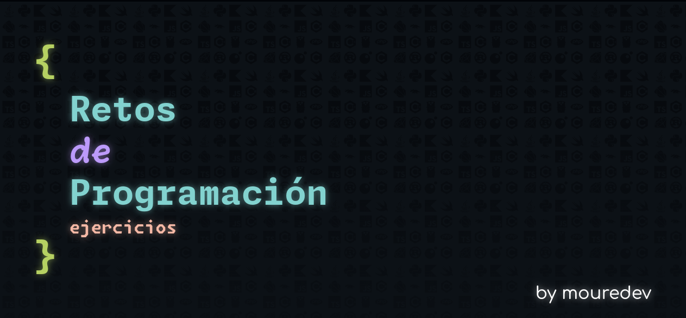

<h1 aling="center"></h1>

# Solutions of Retos de Programacion By Moure Dev

This are my solutions to the [Programming Challenges](https://retosdeprogramacion.com/ejercicios/) made by [MoureDev](https://moure.dev/) in different programming languages.

Click on the name of the challenge to see the solution.

- [JavaScript](https://github.com/ValenProfitos/ejercicios/tree/main/JavaScript)
    01. [The famous "Fizz Buzz"](https://github.com/ValenProfitos/ejercicios/blob/main/JavaScript/fizzbuzz.js):
        - Write a program that prints to the console the numbers from 1 to 100 (both included, with a newline between each print), replacing the following:
            - Multiples of 3 with the word "fizz."
            - Multiples of 3 with the word "buzz."
            - Multiples of both 3 and 5 with the word "fizzbuzz.".
    02. [Is it an anagram?](https://github.com/ValenProfitos/ejercicios/blob/main/JavaScript/anagram.js):
        - Write a function that takes two words (Strings) as input and returns true or false (bool) depending on whether they are or are not anagrams.
        - An anagram involves forming one word by rearranging ALL the letters of another inital word
        - Is not necessary to check whether both words exist.
        - Two words that are exactly the same are not considered anagrams.